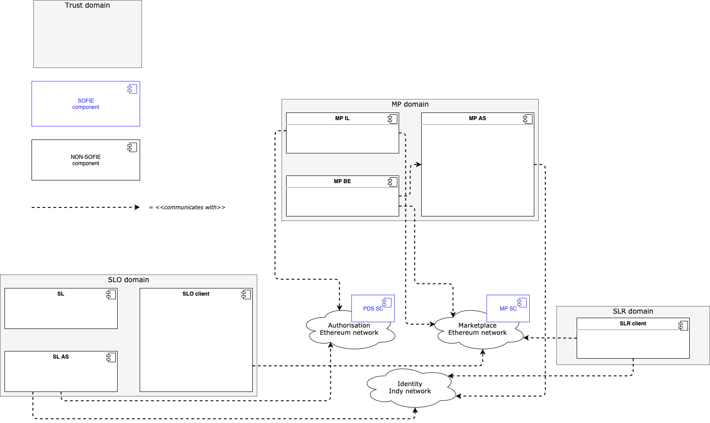
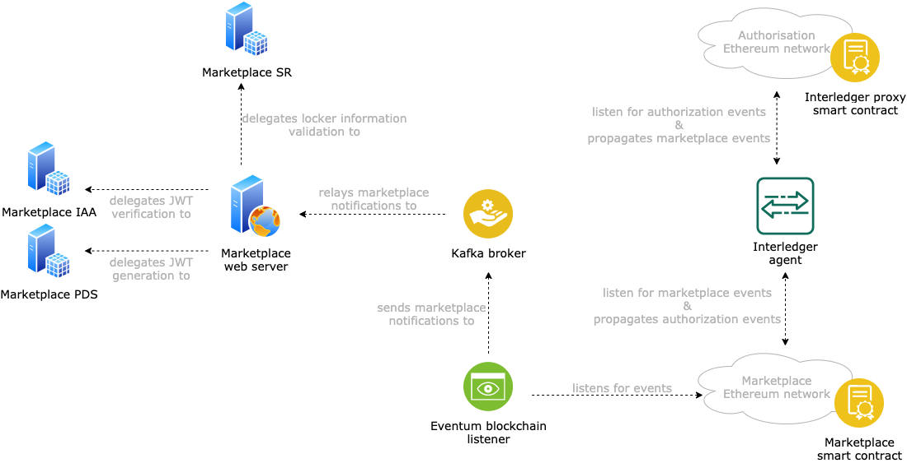
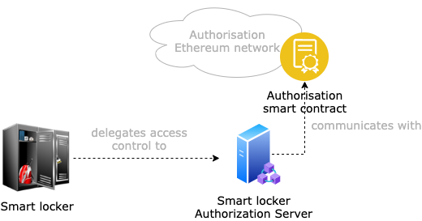

# SMAUG: Secure Marketplace for Access to Ubiquitous Goods

The **Secure Marketplace for Access to Ubiquitous Goods**, or SMAUG, is a decentralized and open marketplace where smart locker owners can put smart lockers for rent, and interested renters can purchase access to those smart lockers for limited amounts of time. The marketplace supports both auction-like and instant-rent operations. For a more detailed explanation of the marketplace functionalities, you can visit the [SMAUG Marketplace repository](https://github.com/SOFIE-project/SMAUG-Marketplace/tree/master/om-smart-contracts).

## Architecture

The SMAUG reference implementation follows a microservice architecture, with several microservices deployed for each of the three business domains: *marketplace owner domain*, *smart locker owner domain*, and *smart locker renter domain*.

A high-level representation of the architecture is given in Fig. 1.

 
<i><b>Figure 1:</b> a high-level representation of the SMAUG architecture. The three main business domains are the marketplace domain, the smart locker owner domain, and the smart locker renter domain.</i>

SMAUG uses two separate Ethereum blockchains: one where the SMAUG marketplace smart contract runs, and one where all the authorization-related information is saved. An [Interledger](https://github.com/SOFIE-project/Interledger) component sits in between the two blockchains, bridging specific events from one to the other and vice versa, implementing a bi-directional data transfer protocol. The use of two separate blockchains ensures very loose coupling of the system, as entities interacting on the marketplace are not aware of the actions performed on the authorization blockchain and are not affected by any changes in the way it works. The same is true in reverse. As long as all the parties can accomplish the operations that the marketplace provides, and can solve any issues that might happen during any of those operations.

### Marketplace (MP) domain

The marketplace domain includes all the components that are under the control of the marketplace owner and that are fundamental to support the marketplace interactions. Fig. 2 shows all the components that are deployed as part of the marketplace domain.

 
<i><b>Figure 2:</b> the architecture of the components that are under the control of the marketplace owner.</i>

- **Marketplace web server**: it is the marketplace backend system. It allows smart locker owners to obtain new access tokens for request creation and allows users to query marketplace details, e.g., the marketplace information, the open requests for a given locker, the offers submitted for a given request, etc. For more details, check the [SMAUG marketplace backend repository](https://github.com/SOFIE-project/SMAUG-Marketplace/tree/master/om-backend).
- **Marketplace SR**: it is the SMAUG semantic representation server. It is a deployment of the [SOFIE Semantic Representation (SR)](https://github.com/SOFIE-project/Semantic-Representation) and customized to fit SMAUG's needs. Specifically, it validates the information that smart locker owners enter when registering a new smart locker in the marketplace management interface served by the marketplace web server. For more details, check the [SMAUG SR repository](https://github.com/SOFIE-project/SMAUG-Marketplace/tree/master/semantic-representation).
- **Marketplace IAA**: it is used to validate [JSON Web Tokens (JWT)](https://jwt.io/) presented by users when interacting with the marketplace web server. It is a deployment of the [SOFIE Identity, Authentication, and Authorization (IAA)](https://github.com/SOFIE-project/identity-authentication-authorization), and it is used to validate bearer JWTs when interacting with the REST APIs exposed by the marketplace web server. For more details, check the [SMAUG IAA repository](https://github.com/SOFIE-project/SMAUG-Marketplace/tree/master/om-iaa).
- **Marketplace PDS**: it is used to issue JWTs upon user's successful authentication using [Decentralized Identifiers (DID)](https://www.w3.org/TR/did-core/). It is a deployment of the [SOFIE Privacy and Data Sovereignty (PDS)](https://github.com/SOFIE-project/Privacy-and-Data-Sovereignty), and it is used to register and login users before interacting with the REST APIs exposed by the marketplace web server. For more details, check the [SMAUG PDS repository](https://github.com/SOFIE-project/SMAUG-Marketplace/tree/master/om-pds).
- **Eventeum blockchain listener**: it is used to listen for events generated by the marketplace smart contract and to deliver them to the marketplace web service via a Kafka broker. It is a deployment of the [Eventum Ethereum event listener](https://github.com/eventeum/eventeum).
- **Kafka broker**: it is used by the marketplace web server to listen for events generated by the marketplace smart contract. While the marketplace web server is the consumer of the messages, the Eventeum blockchain listener is the producer.
- **Marketplace smart contract**: it is the smart contract encapsulating all the logic of the SMAUG marketplace. It is deployed by the marketplace owner. For more details, check the [SMAUG marketplace smart contracts repository](https://github.com/SOFIE-project/SMAUG-Marketplace/tree/master/om-smart-contracts).
- **Interledger proxy smart contract**: is it the smart contract that the Interledger agent uses to broadcast information on the authorization blockchain and to capture information that must be passed to the marketplace blockchain. It is deployed before the Interledger agent is deployed, and the Interledger agent must then be configured to use it. For more details, check the [SMAUG Interledger smart contracts repository](https://github.com/SOFIE-project/SMAUG-Marketplace/tree/master/il-smart-contracts).
- **Interledger agent**: bridges the communication between the marketplace and the authorization blockchain. It is a deployment of the [SOFIE Interledger (IL)](https://github.com/SOFIE-project/interledger), and it is used to exchange data between the marketplace blockchain and the authorization blockchain. For more details, check the [SMAUG IL repository](https://github.com/SOFIE-project/SMAUG-Marketplace/tree/master/il-agent).

### Smart Locker Owner (SLO) domain

The smart locker owner domain includes all the components that are under the control (i.e., either directly managed or trusted) of the smart locker owner. Fig. 3 shows all the components that are deployed as part of the smart locker owner domain.

 
<i><b>Figure 3:</b> the architecture of the components that are under the control or trusted by the smart locker owner.</i>

- **Smart locker**: it is the physical smart locker. It provides storage space and runs SMAUG-compliant software as described in the [SMAUG smart locker IoT platform repository](https://github.com/SOFIE-project/SMAUG-Owner/tree/master/sl-iot), which allows the locker to be discoverable over Bluetooth Low Energy (BLE) and optionally NFC.
- **Smart locker authorization server**: it is the service that manages access to the smart locker. Specifically, it listens for blockchain events that are broadcasted by the Interledger agent on the authorization blockchain via the Interledger proxy smart contract (explained above) and filters the relevant ones, i.e., the ones about requests that refer to one of the smart lockers under its control. Although a smart locker owner can deploy this server, it is more likely that the smart locker owner will delegate to some third-party the deployment and management of it. Potentially, there could be a different authorization server for each smart locker, but more realistically there would be an authorization server for all the smart lockers belonging to one or more smart locker owners. For more details, check the [SMAUG smart locker authorization server repository](https://github.com/SOFIE-project/SMAUG-Owner/tree/master/sl-as-pds).
- **Authorization smart contract**: it is the smart contract that the smart locker authorization server uses to log the generated smart contracts. This log is useful in cases of dispute resolution, to prove that a given access token was issued at a specific time. It is deployed in combination with the authorization server, hence managed by the same entity. Once a set of access tokens have been logged, the authorization server can trigger the Interledger process to transfer the tokens to the marketplace blockchain. This happens with the authorization smart contract calling the method to trigger the data transfer on the Interledger proxy smart contract. For more details, check the [SMAUG smart locker authorization server smart contracts repository](https://github.com/SOFIE-project/SMAUG-Owner/tree/master/sl-as-smart-contracts).

### Smart Locker Renter (SLR) domain

The smart locker renter domain includes only the mobile app that a renter uses to discover nearby smart lockers and to purchase access to them. For more details, check the [SMAUG mobile app repository](https://github.com/SOFIE-project/SMAUG-Renter/tree/master/mobile-application).

## Execution

The SMAUG system can be deployed in a development environment with [Docker Compose](https://docs.docker.com/compose/). The deployment files create several containers mapping 1:1 most of the components listed above.

### Prerequisites

- `docker-compose >= 1.25.5`
- `docker engine >= 19.03.0+`

### Environment startup

First, initialize the submodules with `git submodule update --init`.

After that, run `docker-compose up -d`.

> The first time the environment is set up, all the images must be built. This can take a more or less long time, depending on the machine where the environment is deployed. **It is recommended to have a machine with at least 16 GB of RAM.**

The deployment process will create the following containers:

- `ethereum-authorisation`: the authorization Ethereum blockchain, also accessible on the host machine at `127.0.0.1:8546`.
- `ethereum-marketplace`: the marketplace Ethereum blockchain, also accessible on the host machine at `127.0.0.1:8545`.
- `kafka-marketplace-broker`: the Kafka broker used by the marketplace backend to receive marketplace blockchain events, also accessible on the host machine at `127.0.01:9092`.
- `il-agent`: the Interledger agent.
- `marketplace-agent`: a CLI application that allows to interact with the marketplace smart contract. It can be used by running `docker attach marketplace-agent` to attach to the deployed container.
- `marketplace-listener`: the [Eventeum](https://github.com/eventeum/eventeum) marketplace listener.
- `marketplace-listener-state-db`: a MongoDB instance used internally by the marketplace listener.
- `om-backend`: the marketplace web server, also accessible on the host machine at `127.0.0.1:61234`.
- `om-iaa`: the [SOFIE IAA](https://github.com/SOFIE-project/identity-authentication-authorization) instance used by the marketplace web server, also accessible locally at `127.0.0.1:11001`.
- `semantic-representation`: the [SOFIE SR](https://github.com/SOFIE-project/Semantic-Representation) instance used by the marketplace web server, also accessible on the host machine at `127.0.0.1:5000`.
- `sl-as-blockchain-agent`: the smart locker authorization server (only the blockchain agent part).
- `sl-as-pds`: the [SOFIE PDS](https://github.com/SOFIE-project/Privacy-and-Data-Sovereignty) instance used by the smart locker authorization server, also accessible on the host machine at `127.0.0.1:9001`.
- `zookeeper-marketplace`: an instance of [Zookeeper](https://zookeeper.apache.org/) used to manage the Kafka broker used by the marketplace web server.

## Test

This repository does not contain any unit tests or examples, as it is just an integration repository. For the tests specific to each component, you can check each repository as linked in the component lists above.

### SOFIE requirement validation

One of the purposes of SMAUG is to validate some of the requirements that the SOFIE framework 
must fulfill. These requirements are described in [SOFIE deliverable 2.6: Federation Architecture, Final Version](https://media.voog.com/0000/0042/0957/files/SOFIE_D2.6-Federation_Architecture_final_version-2.pdf). Specifically, SMAUG is used to prove that the SOFIE framework fulfills the architectural requirement **RA05**, and the functional requirement **RF23**. For a step-by-step guide to use the test deployment to validate the requirements, refer to the [dedicated page](docs/pages/requirements_validation.md).

## Known Issues

SMAUG is a proof-of-concept and a reference implementation, useful to demonstrate one *possible* way to integrate all the SOFIE framework components into a use case. The code is not production quality and does not handle all possible error situations. Hence, any of the components might generate errors that bring the system to a not working state, requiring re-deployment of the faulty components.

## Contact Info

Antonio Antonino&nbsp;&nbsp;&nbsp;&nbsp;&nbsp;&nbsp;&nbsp;&nbsp;&nbsp;-&nbsp;&nbsp;&nbsp;&nbsp;&nbsp;&nbsp;[antonio.antonino@ericsson.com](mailto:antonio.antonino@ericsson.com)

Santeri Paavolainen&nbsp;&nbsp;&nbsp;&nbsp;&nbsp;-&nbsp;&nbsp;&nbsp;&nbsp;&nbsp;&nbsp;[santeri.paavolainen@ericsson.com](mailto:santeri.paavolainen@ericsson.com)

Filippo Vimini&nbsp;&nbsp;&nbsp;&nbsp;&nbsp;&nbsp;&nbsp;&nbsp;&nbsp;&nbsp;&nbsp;&nbsp;&nbsp;&nbsp;&nbsp;&nbsp;-&nbsp;&nbsp;&nbsp;&nbsp;&nbsp;&nbsp;[filippo.vimini@ericsson.com](mailto:filippo.vimini@ericsson.com)

Mikko Mustonen&nbsp;&nbsp;&nbsp;&nbsp;&nbsp;&nbsp;&nbsp;&nbsp;&nbsp;&nbsp;&nbsp;-&nbsp;&nbsp;&nbsp;&nbsp;&nbsp;&nbsp;[mikko.mustonen@ericsson.com](mailto:mikko.mustonen@ericsson.com)